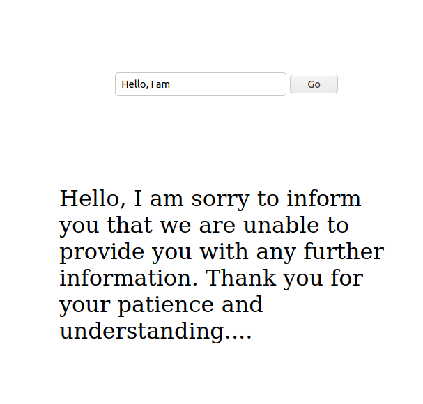

# Generate text using GPT2 🤖 

This repo has code that builds a simple web app and allows end-users to provide a prompt that then is used by GPT2 to generate an output. 

In general, this is quite slow on my machine as I have my GPU disabled. This is a good example repo for other things TRANSFORMER related.
It uses `rust-bert` as the core of NLP models and you can swap out bits for other bits and build a more fun set of examples. 
